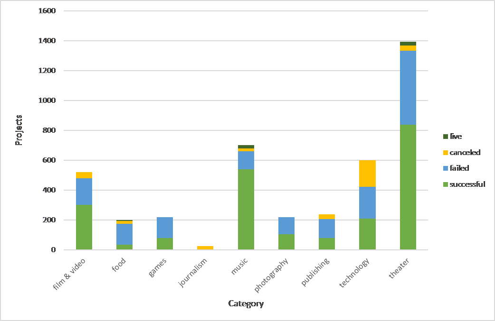

# Kickstarter and it's Funding Dilemma

## Setting
Kickstarter is crowdsourcing platform where a community of supporters can financially support an idea and/or an organization for the purpose of launching their proposed project. According to kickstarter.com, "`14 million people` have backed a project, `3.4 billion USD` has been pledged, and `134,115 projects` have been successfully funded."

## Dilemma
Even though over three billion dollars have been raised in the 8 years of Kickstarter's existence only a third of the projects launched have made it through the funding process with a positive outcome.

## Question //consider changing the name of this heading
<strong>Considering only the US market.</strong> Three question that upcoming projects should consider are:
* Is my project worth launching on this platform?
* If it is, how much funding is optimal for this project?
* And, is there an ideal time in the year to launch my project?

## Chart One
is so beautiful
 

<!--  -->
  
## Chart Two
is even more beautifuller

<!--  -->
  
## Chart Three
is blindfully gorgeous

<!--  -->
  
## Chart Four
is the most beautifullest ever

<!--  -->
